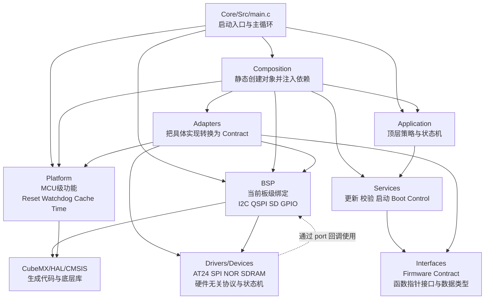
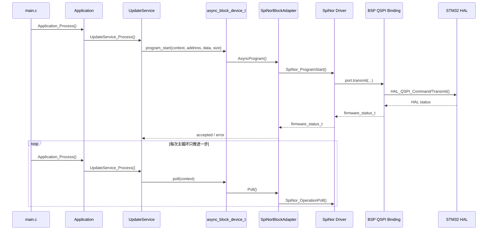
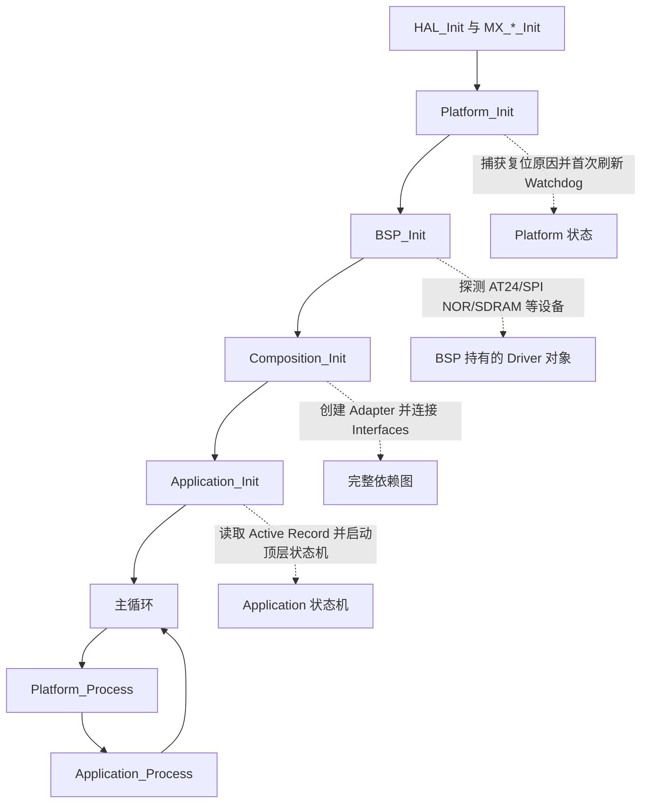
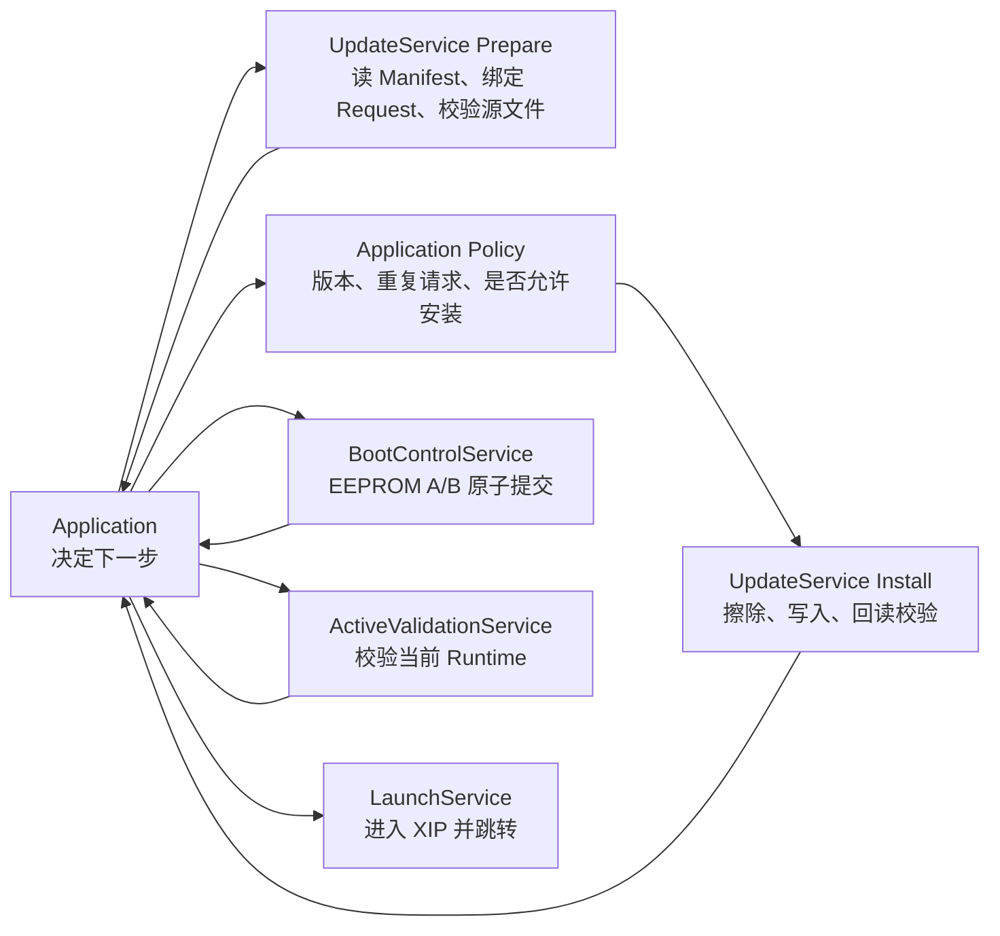

# Adapters、Composition、Interfaces 与 Services 设计说明

本文解释当前 `stm32h7boot` 工程中最容易混淆的几个层：`Adapters`、`Composition`、`Interfaces`、`Services`，并对比常见的“Service 直接调用 Platform 函数”的写法。

本文讨论的是代码组织和依赖关系，不改变 Bootloader 的升级、校验和启动业务规则。

## 1. 先记住一句话

```text
Application 决定整个系统下一步做什么
Services    决定一项能力具体如何完成
Interfaces  定义 Services 需要什么底层能力
Adapters    把具体硬件实现转换成 Interfaces
Composition 负责把所有对象连接起来
```

例如，Application 只需要知道“安装升级包”，Update Service 只需要知道“读写一个异步块设备”，而不需要知道底层是 W25Q256、QSPI、STM32 HAL 还是某个具体的 `hspi` 句柄。

## 2. 当前工程的总体关系



这里的箭头主要表示编译期依赖。`Interfaces` 位于中间，是稳定的契约，不是一个运行时模块，也不负责创建对象。

## 3. 各层分别负责什么

### 3.1 Drivers/Devices：设备协议和设备状态机

当前工程中的例子：

- `Drivers/Devices/At24/at24.c`：AT24 EEPROM 的页边界、写周期、ACK polling、超时状态。
- `Drivers/Devices/SpiNor/spi_nor.c`：JEDEC 探测、读、页编程、扇区擦除、异步操作状态。
- `Drivers/Devices/Sdram/sdram.c`：SDRAM 初始化命令顺序。

设备驱动不应该包含 `stm32h7xx_hal.h`、`quadspi.h` 或具体板子的句柄。它们通过 `at24_port_t`、`spi_nor_port_t`、`sdram_port_t` 接收底层传输函数。

```text
Driver 只知道：
    “我要发送一条 SPI NOR 命令”

BSP 决定：
    “这条命令由 hqspi 通过 HAL_QSPI_Command 发出去”
```

### 3.2 BSP：当前电路板的绑定

`BSP` 负责把设备驱动接到当前板子上。例如：

- `BSP_ExternalFlashInit()` 把 `hqspi` 转换成 `spi_nor_port_t`。
- `BSP_EepromInit()` 把 `hi2c1` 转换成 `at24_port_t`。
- `BSP_ExternalFlashDevice()` 和 `BSP_EepromDevice()` 返回 BSP 持有的静态设备对象。

BSP 知道板子的引脚、外设句柄、HAL 参数和传输方式，但不应该决定升级策略，也不应该知道 `Active Record` 或 `Manifest`。

### 3.3 Platform：不属于某个具体外设的 MCU 能力

`Platform/STM32H7` 处理的是 MCU 级功能：

- `Platform_Init()`、`Platform_Process()`；
- Watchdog refresh；
- System reset；
- D-Cache maintenance；
- critical section；
- 单调毫秒时钟。

例如，QSPI 外部 Flash 是 BSP/Driver 关注的设备，但 Cache 失效是 Platform 提供的 MCU 能力。

### 3.4 Interfaces：把“需要什么”写成 Contract

`Interfaces/include/firmware` 中的文件不实现业务，也不直接访问硬件。它们定义上层需要的能力，例如：

- `async_block_device_t`：异步读、写、擦除和轮询；
- `package_source_t`：挂载发布卷、打开固定文件、读取文件；
- `xip_controller_t`：进入/退出 QSPI memory-mapped 模式；
- `application_jump_t`：跳转到已验证的 Application；
- `system_clock_t`、`log_sink_t`。

一个接口本质上是 C 语言的“对象 + 方法表”：

```c
typedef struct
{
    void *context;
    firmware_status_t (*read)(
        void *context,
        uint32_t address,
        void *data,
        uint32_t size);
} async_block_device_t;
```

使用者不关心 `context` 指向什么，只调用方法：

```c
status = storage->read(storage->context, address, buffer, size);
```

`context` 的作用类似 C++ 对象方法中的 `this`。因此同一份 Service 代码可以使用 SPI NOR、RAM Fake、Host 文件或测试桩。当前外部 Flash 只暴露异步 `async_block_device_t`，避免同步擦除/编程绕过主循环的有界执行约束。

### 3.5 Adapters：把已有实现转换成接口

Adapter 是一层“翻译器”，通常不包含业务规则。当前工程中的例子：

| Adapter | 输入 | 输出 | 主要职责 |
|---|---|---|---|
| `SpiNorBlockAdapter` | `spi_nor_t` | `async_block_device_t` | 转发读写擦除，映射异步状态，检查页边界 |
| `At24BootControlAdapter` | `at24_t` | `boot_control_store_t` | 转发 EEPROM 读写和 ready polling |
| `FatFsPackageSourceAdapter` | CubeMX FatFs/SDFile | `package_source_t` | 管理挂载、固定文件和共享文件所有权 |
| `Stm32QspiXipAdapter` | `QSPI_HandleTypeDef` | `xip_controller_t` | 管理 indirect/memory-mapped 和 Cache |
| `CortexMApplicationJumpAdapter` | Cortex-M 寄存器 | `application_jump_t` | 清理中断、设置 VTOR/MSP、跳转 Reset Handler |
| `UartLogAdapter` | BSP Debug UART | `log_sink_t` | 转发日志字节流 |

Adapter 的价值并不只是“多包一层函数”。它还可以承载边界和后置条件，例如：

- SPI NOR 单次编程不能跨页；
- QSPI 退出后必须真实确认硬件已经离开 memory-mapped；
- FatFs `f_close()` 失败时不能提前清除文件所有权；
- Cortex-M 跳转前必须清理 SysTick 和 NVIC。

## 4. 为什么需要 Composition

`Composition` 是 Composition Root，也可以理解为“总装配点”。它不做升级决策，只做以下事情：

1. 创建静态生命周期的 Driver、Adapter、Service 对象；
2. 初始化底层对象；
3. 取得 Adapter 暴露的接口指针；
4. 填充 Service 的依赖结构体；
5. 最后把完整依赖图交给 Application。

当前实现位于 [`Composition/src/composition.c`](../../Composition/src/composition.c)。例如：

```c
SpiNorBlockAdapter_Init(&external_flash_adapter,
                        BSP_ExternalFlashDevice());

external_flash = SpiNorBlockAdapter_AsyncInterface(&external_flash_adapter);

launch_dependencies.storage = external_flash;
launch_dependencies.xip_controller =
    Stm32QspiXipAdapter_Interface(&xip_adapter);
launch_dependencies.application_jump =
    CortexMApplicationJumpAdapter_Interface(&jump_adapter);

LaunchService_Init(&launch_service, &launch_dependencies);
```

这段代码表达的是“哪个具体对象满足哪个抽象能力”。如果没有 Composition，这些绑定就会散落在 `main.c`、Service 初始化函数和各种全局变量中。

## 5. 一次真实的调用链

以更新 APP 为例，业务层只看到 `storage` 接口，最终才落到底层 HAL：



这里的重点是：`UpdateService` 不需要知道 `HAL_QSPI_Transmit()` 的存在；`SpiNor Driver` 也不需要知道 `UpdateService` 的存在。

## 6. 启动时的初始化顺序

当前 `Core/Src/main.c` 的关键顺序是：



`Composition_Init()` 失败时，Application 不应该看到“半初始化”的依赖图。当前代码只有所有 Service 初始化成功并且 `Application_Configure()` 成功后，才设置 `composition_initialized`。

## 7. Services 和 Application 如何分工

以更新流程为例：



判断归属时可以问：

| 问题 | 所属层 |
|---|---|
| 整个固件下一步做什么？ | Application |
| 版本是否允许升级？ | Application 的策略，或独立 Policy 能力 |
| APP 文件如何分块读取、哈希、写入、回读？ | Update Service |
| EEPROM 如何分页写和轮询？ | AT24 Driver + Adapter |
| QSPI 是否真的退出 memory-mapped？ | QSPI Adapter |
| 当前 Active Record 是否有效？ | Boot Control Service |
| 具体调用哪个 HAL 句柄？ | BSP |

## 8. 和 `o2_main_fw` 的写法对比

`o2_main_fw` 常见的调用链是：

```mermaid
flowchart LR
    Main[application/main.c]
    Service[user/services/svc_i2c.c]
    Platform[platform_i2c_read_it()]
    Backend[platform/src/port/.../i2c_backend.c]
    HAL[GD32 Peripheral API]

    Main --> Service
    Service --> Platform
    Platform --> Backend
    Backend --> HAL
```

例如：

```c
status = platform_i2c_read_it(address, buffer, length);
```

这种方式的特点：

- 调用链短，容易阅读；
- 适合单一 MCU、单一板卡、业务规模较小的固件；
- Service 直接依赖 `platform/*.h`；
- 更换硬件时，Service 往往也要修改；
- 单元测试通常需要替换全局函数、链接桩或整套 Platform。

当前工程的调用链是：


对应代码类似：

```c
status = service->storage->read(
    service->storage->context,
    address,
    buffer,
    size);
```

两种写法的本质区别：

| 对比项 | `o2_main_fw` 风格 | 当前工程风格 |
|---|---|---|
| 依赖方式 | Service 直接调用 Platform 函数 | Service 调用注入的 Interface |
| 硬件绑定 | 通过固定模块名和全局实现绑定 | 由 Composition 在启动时绑定 |
| 测试替换 | 需要链接桩或修改 Platform | 传入 Fake Interface 即可 |
| 代码数量 | 较少 | 较多 |
| 调试路径 | 直观 | 需要跟函数指针和 `context` |
| 适合场景 | 单板、单平台、功能中小型 | 多硬件变体、强边界、复杂状态机 |

两种写法都可以是正确设计。不是“用了 Interface 就一定更高级”，而是看项目是否真的需要隔离变化和替换实现。

## 9. 为什么这些函数结构看起来少见

在 C 项目中，最常见的是：

```c
void svc_core_update(void)
{
    platform_process();
}
```

当前工程使用的是：

```c
typedef struct
{
    void *context;
    firmware_status_t (*poll)(void *context);
} async_block_device_t;

service->storage->poll(service->storage->context);
```

这不是特殊的 C 语法，而是手写的动态绑定。它通常在以下场景出现：

- 同一个 Service 需要支持多个硬件实现；
- 需要 Host Fake 或单元测试；
- 一个产品有多个板卡变体；
- 需要把 HAL、文件系统和设备驱动排除在业务层之外；
- 需要明确对象所有权和生命周期。

如果这些需求不存在，也可以使用更简单的直接函数调用。可以采用折中方案：业务 Service 使用少量接口，普通工具函数和单板固定能力仍直接调用 Platform/BSP。

## 10. 阅读当前代码的推荐顺序

不要从 Adapter 单个函数开始读，建议按下面顺序建立整体概念：

1. 阅读 [`Core/Src/main.c`](../../Core/Src/main.c)，确认初始化顺序和主循环。
2. 阅读 [`Composition/src/composition.c`](../../Composition/src/composition.c)，看具体对象如何连接。
3. 阅读 [`Application/src/application.c`](../../Application/src/application.c)，看顶层状态机。
4. 阅读 `Services/include/services/use_case/*_api.h`，看 Service 对外契约。
5. 阅读 `Interfaces/include/firmware/*.h`，看 Service 需要的底层能力。
6. 最后阅读对应 Adapter、BSP 和 Driver 的实现。

以外部 Flash 为例：

```text
Application
  -> UpdateService
  -> async_block_device_t
  -> SpiNorBlockAdapter
  -> spi_nor_t
  -> BSP_ExternalFlashInit() 建立的 QSPI port
  -> HAL_QSPI_*
```

以 EEPROM 为例：

```text
BootControlService
  -> boot_control_store_t
  -> At24BootControlAdapter
  -> at24_t
  -> BSP_EepromInit() 建立的 I2C port
  -> HAL_I2C_*
```

## 11. 是否应该保留这套架构

可以用下面的标准判断：

### 建议保留 Adapter/Interface 的情况

- 升级、掉电恢复、XIP、Cache 等错误后果严重；
- 需要 Host 测试或 Fake 存储；
- 未来可能更换 SD/eMMC、QSPI 控制器或板卡；
- Service 状态机较复杂，不能混入 HAL 细节；
- 需要明确规定谁拥有文件、Buffer、设备和接口生命周期。

### 可以简化的情况

- 只有一块板、一种硬件，且产品生命周期短；
- 没有 Host 测试计划；
- 业务逻辑很少，主要是周期采样和控制；
- Adapter 只是完全无状态的一行转发，且没有边界或后置条件。

当前 Bootloader 中，`SpiNorBlockAdapter`、`At24BootControlAdapter`、`FatFsPackageSourceAdapter`、`Stm32QspiXipAdapter` 的边界价值较高；`ClockAdapter`、`WatchdogAdapter`、`UartLogAdapter` 比较薄，主要作用是统一依赖入口。

## 12. 最终心智模型

```text
Driver：我知道某个芯片协议怎么工作。
BSP：我知道这块板子的芯片接在哪个外设句柄上。
Platform：我知道这个 MCU 的通用能力怎么用。
Interface：我只声明上层需要什么能力。
Adapter：我把具体实现翻译成这个能力。
Service：我用这些能力完成一项完整业务。
Application：我决定这些业务按什么顺序执行。
Composition：我把所有具体对象接到正确的位置。
```

最关键的不是目录名称，而是依赖方向：

```text
业务层不向下查找硬件；
硬件实现向上满足接口；
只有 Composition 知道具体实现应该绑定到哪里。
```
